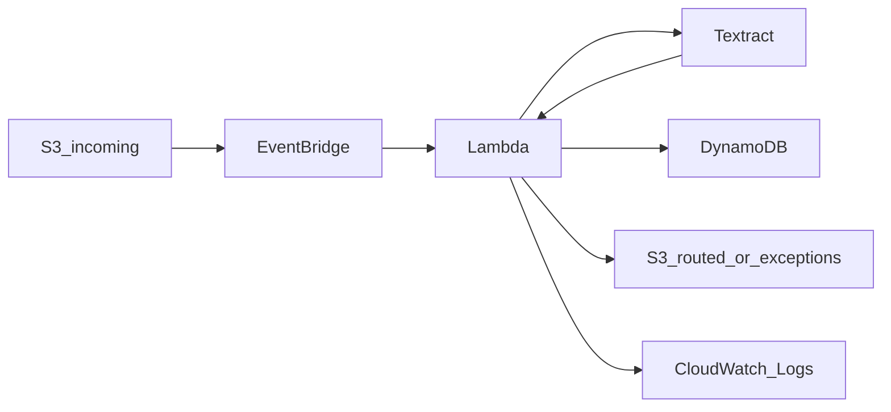

# Intelligent Document Routing Pipeline on AWS

Serverless pipeline that ingests documents from Amazon S3, extracts text with **Amazon Textract**, classifies content with **transparent keyword rules**, stores structured metadata in **DynamoDB**, and **routes** the original file to prefix-based destinations—demonstrating event-driven design, least-privilege IAM, and operational logging for entry-level cloud and automation roles.

**Example scenario:** healthcare-style fax or document intake (referrals, labs, authorizations) described only as a **realistic illustration**. The same pattern applies to insurance, legal, or operations teams that need to triage PDFs and images without claiming production compliance in this repo.

---

## Architecture overview

1. Upload a file to **`incoming/`** in the documents bucket.  
2. **Amazon EventBridge** receives the S3 `Object Created` event and invokes **AWS Lambda** (this avoids a CloudFormation circular dependency from wiring S3 directly to Lambda in the same stack).  
3. Lambda starts **async Textract** OCR and polls until text is available.  
4. **Classifier** scores categories using keyword lists (see [classifier.py](src/classifier.py)).  
5. **DynamoDB** stores metadata (classification, preview, routing, status).  
6. The object is **copied** to `routed/<category>/` or `exceptions/`, then **deleted** from `incoming/`.  
7. **CloudWatch Logs** record structured events for traceability.



## AWS services used

| Service | Role |
|--------|------|
| Amazon S3 | Ingest, routed output, exceptions |
| Amazon EventBridge | S3 object-created events → Lambda |
| AWS Lambda | Orchestration |
| Amazon Textract | OCR (async document text detection) |
| Amazon DynamoDB | Metadata store |
| AWS IAM | Least-privilege roles (via SAM) |
| Amazon CloudWatch Logs | Application logging |

Infrastructure is defined in [template.yaml](template.yaml) (AWS SAM).

---

## Key features

- Event-driven processing (S3 → EventBridge → Lambda)  
- Async Textract with configurable polling  
- Rule-based classification with matched keywords and a simple confidence score  
- Structured DynamoDB records for audit-style traceability  
- Routing by category plus **unclassified** and **exception** paths  
- JSON-oriented logging (truncate long OCR text in logs)

---

## Example routing categories

| Category | Illustrative keywords (see code) |
|----------|----------------------------------|
| `referral` | referral, specialist, consult, … |
| `lab_result` | laboratory, specimen, reference range, … |
| `insurance` | insurance, payer, deductible, … |
| `authorization` | prior authorization, approved, … |
| `progress_note` | SOAP, progress note, encounter, … |
| `imaging` | MRI, CT, radiology, findings, … |
| `unclassified` | No keyword match |

---

## Repository structure

```text
├── README.md
├── template.yaml              # SAM / CloudFormation
├── samconfig.toml.example
├── pytest.ini
├── requirements.txt           # Lambda deps (boto3 in runtime)
├── requirements-dev.txt
├── architecture/
│   ├── decisions.md
│   └── README.md
├── src/
│   ├── requirements.txt       # SAM CodeUri (mirrors root stub)
│   ├── handler.py             # Lambda entry point
│   ├── textract_service.py
│   ├── classifier.py
│   ├── router.py
│   ├── metadata_store.py
│   ├── logger_util.py
│   └── config.py
├── tests/
│   ├── test_classifier.py
│   ├── test_router.py
│   └── test_handler.py
├── sample_documents/
│   └── README.md
├── scripts/
│   └── smoke_test.ps1         # Optional upload helper after deploy
└── docs/
    ├── deployment.md
    ├── usage.md
    ├── future-improvements.md
```

---

## Tooling and deployment

**AWS SAM CLI** (install on Windows: `winget install --id Amazon.SAM-CLI -e`). Confirm with `sam --version`.

From the repository root:

```bash
sam build
sam deploy --guided
```

`--guided` writes settings to `samconfig.toml` (gitignored). You can copy [samconfig.toml.example](samconfig.toml.example) as a starting point.

Non-interactive example:

```bash
sam deploy --stack-name doc-routing-pipeline --capabilities CAPABILITY_IAM --resolve-s3 --no-confirm-changeset --region us-east-1
```

Full steps and post-deploy checks: [docs/deployment.md](docs/deployment.md). Stack outputs include the **bucket name** and **DynamoDB table** for smoke tests.

After deploy, you can upload the sample PDF with [scripts/smoke_test.ps1](scripts/smoke_test.ps1) (pass your bucket name from stack outputs). OCR can take a few minutes; Lambda/Textract waits are configured for up to **five minutes** (see `template.yaml`).


## Example processing flow

1. Upload `referral_001.pdf` to `incoming/referral_001.pdf`.  
2. Textract returns text mentioning *referral*, *specialist*, *consult*.  
3. Classifier selects **referral**; metadata is written to DynamoDB.  
4. File appears under `routed/referral/<document_id>_referral_001.pdf`.  
5. CloudWatch shows `process_complete` with category and confidence.

Event payload shape (EventBridge): [docs/usage.md](docs/usage.md).

---

## Example DynamoDB metadata record

| Attribute | Example |
|-----------|---------|
| `document_id` | `a1b2c3d4-e5f6-7890-abcd-ef1234567890` |
| `original_filename` | `referral_001.pdf` |
| `upload_timestamp` | `2026-04-08T12:00:00.000Z` |
| `processing_timestamp` | `2026-04-08T12:00:12Z` |
| `source_bucket` | `your-bucket` |
| `source_key` | `incoming/referral_001.pdf` |
| `extracted_text_preview` | First N characters of OCR text |
| `classification` | `referral` (or `error` on failure) |
| `matched_keywords` | `["referral", "specialist"]` |
| `routing_destination` | `s3://your-bucket/routed/referral/` |
| `destination_key` | `routed/referral/<id>_referral_001.pdf` |
| `processing_status` | `completed` or `failed` |
| `confidence` | e.g. `0.2857` (rule-based) |
| `error_message` | Empty on success |

---

## Future improvements

Summarized in [docs/future-improvements.md](docs/future-improvements.md): confidence thresholds, SNS, EventBridge custom buses, Step Functions where justified, ML-based classification, idempotency, DLQs.

---

## Security notes

- IAM policies limit Lambda to the documents bucket, metadata table, and Textract async APIs.  
- No credentials in source; configuration is via environment variables from SAM.  
- S3 encryption at rest (SSE-S3) is enabled in the template.  
- **This is a portfolio demonstration**, not a HIPAA or regulated production design—see [architecture/decisions.md](architecture/decisions.md).

---

## Local tests

```bash
pip install -r requirements-dev.txt
pytest
```
